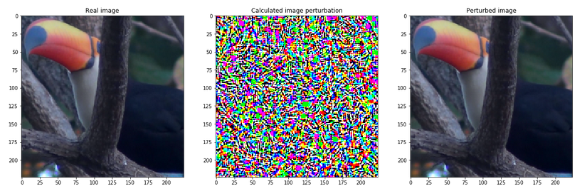

# Harnessing the power of Adversarial Attacks
This repository contains a jupyter notebook presentation of how to do adversarial pertubations to images to make state-of-the-art classification models guess classify images wrong.

In the notebook AdversarialAttack we present a method based on [this paper](https://arxiv.org/pdf/1412.6572.pdf) to perturb images in such a way that they are not recognized by different classification algorithms, while still being recognizable to human being.

The image presented is the following perturbed with the mask:

When feeding the original image to the left to [AlexNet](https://papers.nips.cc/paper/4824-imagenet-classification-with-deep-convolutional-neural-networks.pdf) it classifies it as a toucan with a probability of 81.9%

When feeding the right image, which is the perturbed version of the image, to the same model as above it is not as sure. It gives the image the label of goldfish with a probability of 58.8%. 

This is interesting because the perturbation added to the image is not noticable to the human eye. This calls for new methods of augmenting datasets to create more robust models

## Useful Resources
* [Modifying traffic signs to make selfdriving cars misread the sign](https://www.youtube.com/watch?v=4uGV_fRj0UA)
* [Methods of making more models more robust against adversarial attacks](https://arxiv.org/pdf/1706.06083.pdf)
